# Database

A database is an organized collection of data, and it can be easily accessed & managed.
where data can be organized into table, row, column, key and index and find relevant information.
The main purpose of the database is to operate large amount of information by storing, retrieving and managing data.

# DBMS

Database management system is a software that is used to manage the database.  A DBMS serves as an interface end-user and database, allowing users to use database, allowing user to create read, delete data in the database.

Most widely used type of DBMS software are 

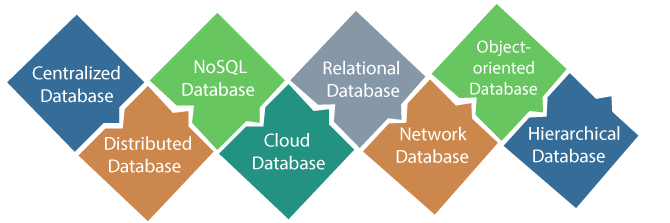

## Centralized Database

It is the type of database that stores data at a centralized database system.
It comforts the users to access the stored data from different locations through several applications.
These applications contain the authentication process to let users access data securely. 
An example of a Centralized database can be Central Library that carries a central database of each library in a college/university.

#### Advantages of centralized database

It has decreased the risk of data management, i.e., manipulation of data will not affect the core data.
Data consistency is maintained as it manages data in a central repository.
It provides better data quality, which enables organizations to establish data standards.
It is less costly because fewer vendors are required to handle the data sets.

#### Disadvantages of centralized database

The size of the centralized database is large, which increases the response time for fetching the data.
It is not easy to update such an extensive database system.
If any server failure occurs, entire data will be lost, which could be a huge loss.

## Distributed Database

Unlike a centralized database system, in distributed systems, data is distributed among different database systems of an organization.
These database systems are connected via communication links. 
Such links help the end-users to access the data easily. 
Examples of the Distributed database are Apache Cassandra, HBase, Ignite, etc.

#### Homogeneous DDB

Those database systems which execute on the same operating system and use the same application process and carry the same hardware devices.

#### Heterogeneous DDB

Those database systems which execute on different operating systems under different application procedures, and carries different hardware devices.

#### Advantages of DDB

Modular development is possible in a distributed database, i.e., the system can be expanded by including new computers and connecting them to the distributed system.
One server failure will not affect the entire data set.

## Relational Database

This database is based on the relational data model, which stores data in the form of rows(tuple) and columns(attributes), and together forms a table(relation). 
A relational database uses SQL for storing, manipulating, as well as maintaining the data. 

E.F. Codd invented the database in 1970. 
Each table in the database carries a key that makes the data unique from others. 
Examples of Relational databases are MySQL, Microsoft SQL Server, Oracle, etc.

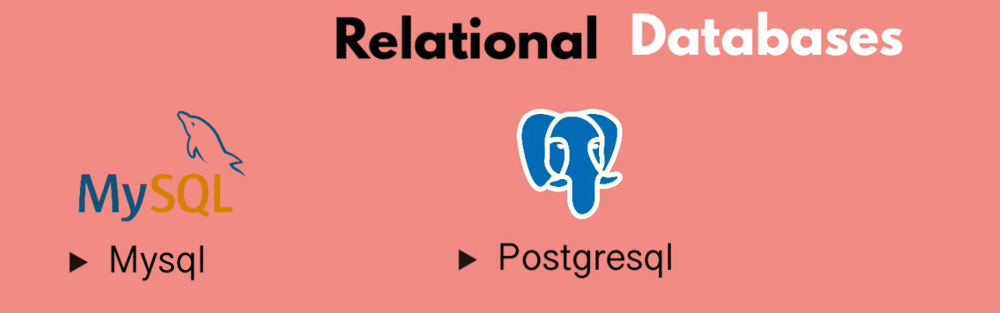
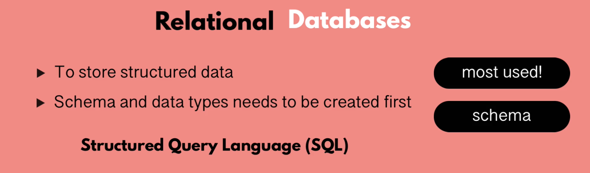
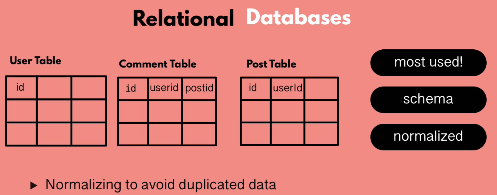
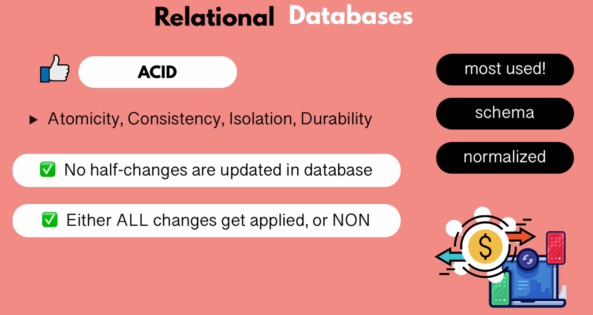
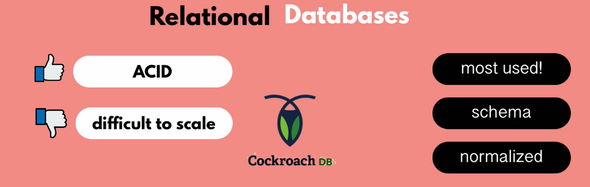

#### Properties of Relational Database

There are following four commonly known properties of a relation model known as ACID properties where:

**A means Atomicity:** This ensures the data operation will complete either with success or with failure. 
It follows the 'all or nothing' strategy. 
For example, a transaction will either be committed or will abort.

**C means Consistency:** If we perform any operation over the data, its value before and after the operation should be preserved. 
For example, the account balance before and after the transaction should be correct, i.e., it should remain conserved.

**I means Isolation:** There can be concurrent users for accessing data at the same time from the database. 
Thus, isolation between the data should remain isolated. 
For example, when multiple transactions occur at the same time, one transaction effects should not be visible to the other transactions in the database.

**D means Durability:** It ensures that once it completes the operation and commits the data, data changes should remain permanent.

# NoSQL Database

Non-SQL/Not Only SQL is a type of database that is used for storing a wide range of data sets. 
It is not a relational database as it stores data not only in tabular form but in several different ways. 
It came into existence when the demand for building modern applications increased. 
Thus, NoSQL presented a wide variety of database technologies in response to the demands. 
We can further divide a NoSQL database into the following four types:

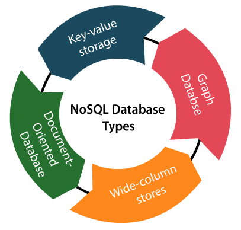

**Key-value storage:** It is the simplest type of database storage where it stores every single item as a key (or attribute name) holding its value, together.

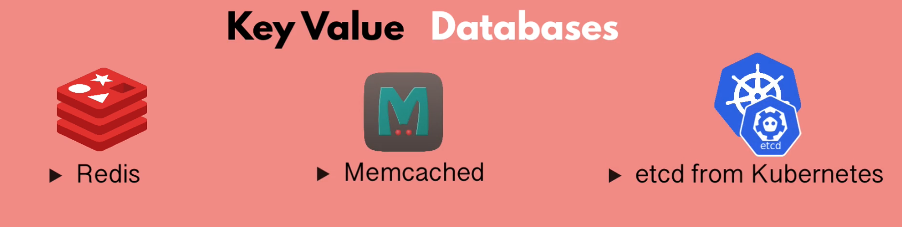
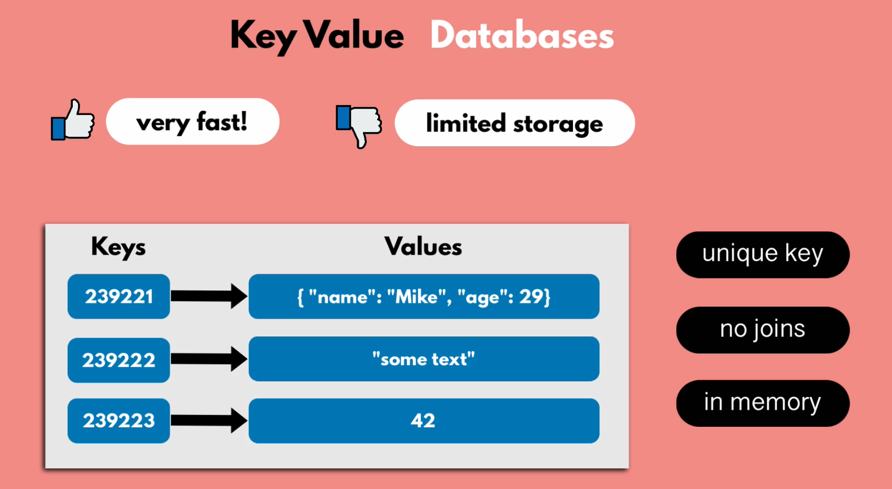
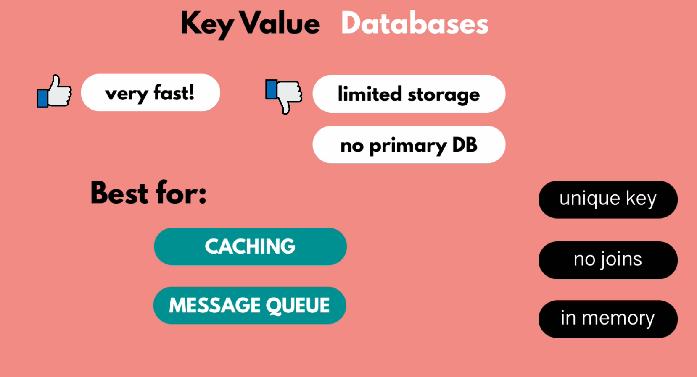

**Wide-column stores:** It is similar to the data represented in relational databases. Here, data is stored in large columns together, instead of storing in rows.

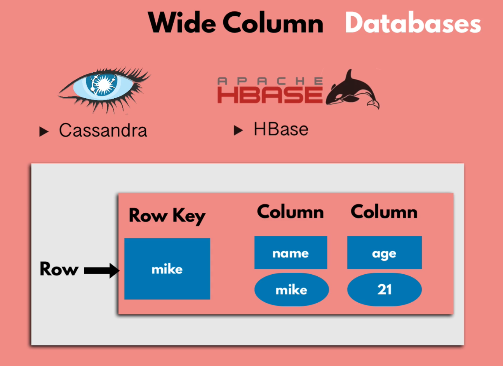
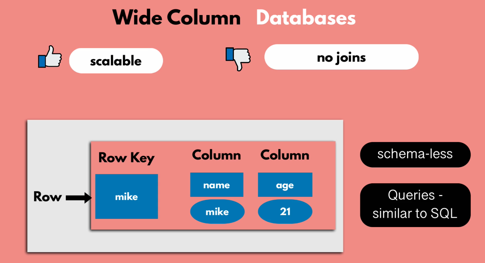
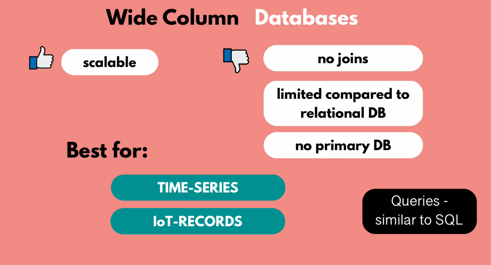

**Document-oriented Database:** A type of database used to store data as JSON-like document. It helps developers in storing data by using the same document-model format as used in the application code.

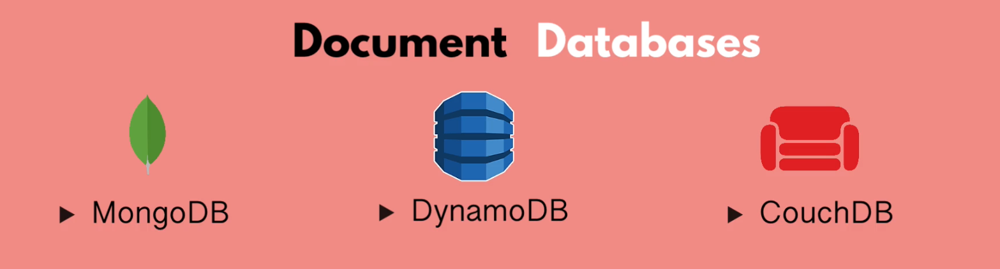
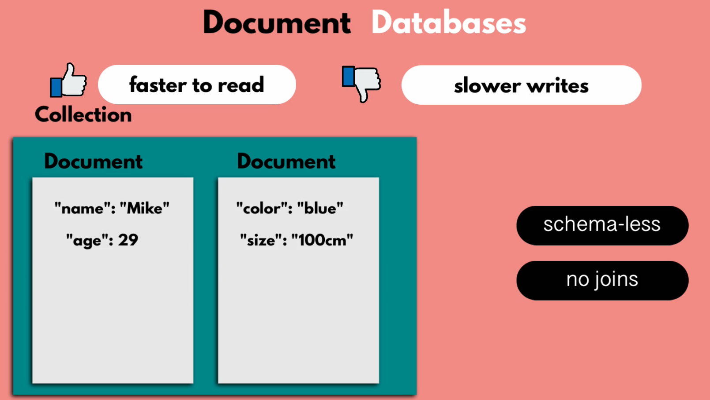
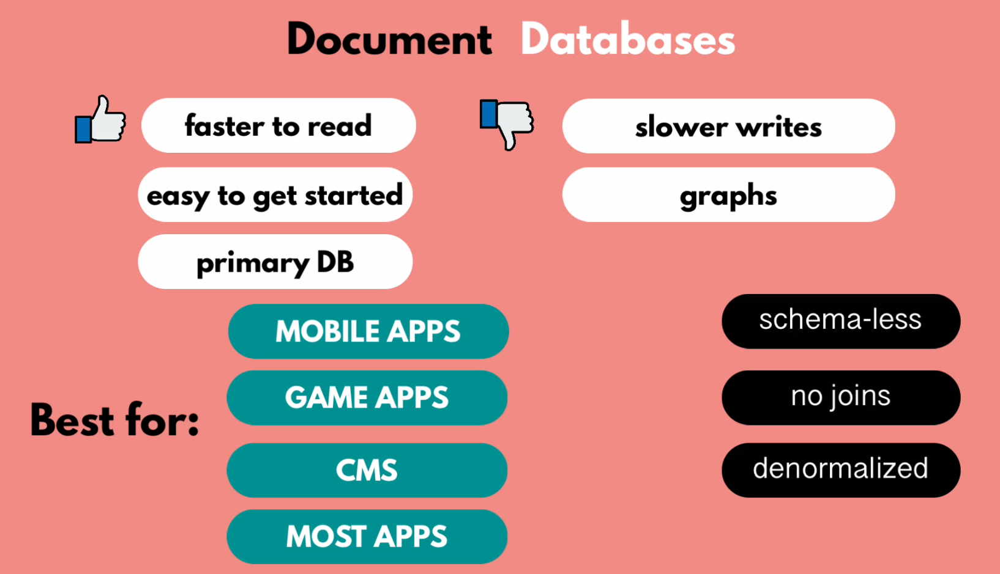

**Graph Databases:** It is used for storing vast amounts of data in a graph-like structure. Most commonly, social networking websites use the graph database.

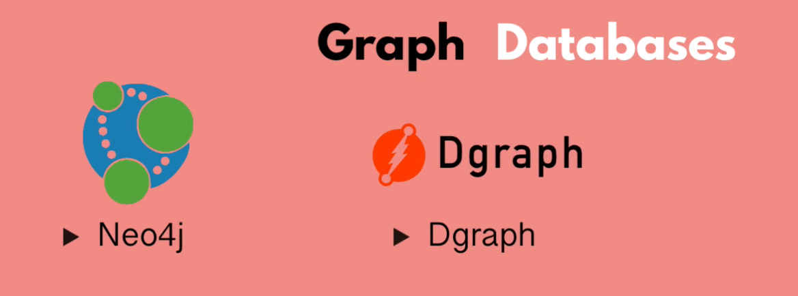
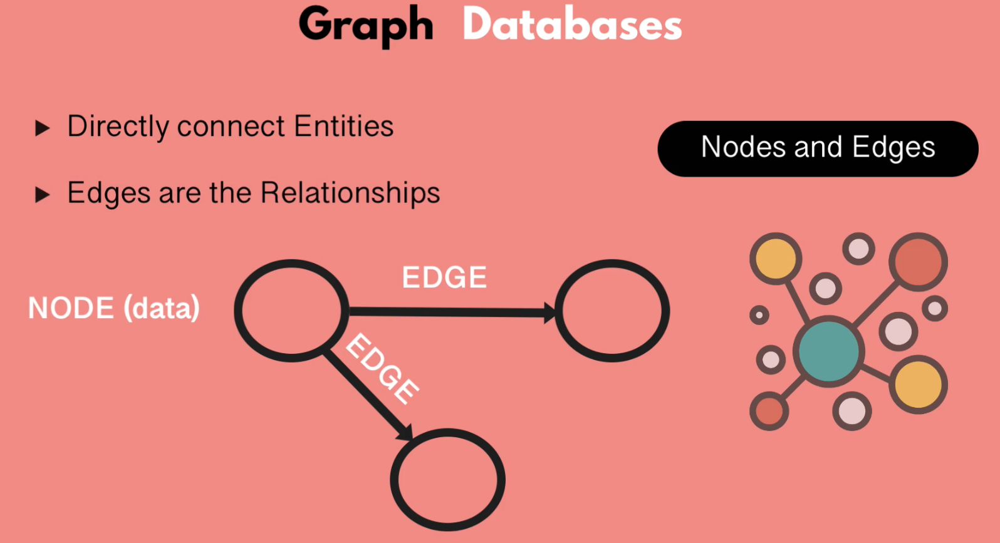
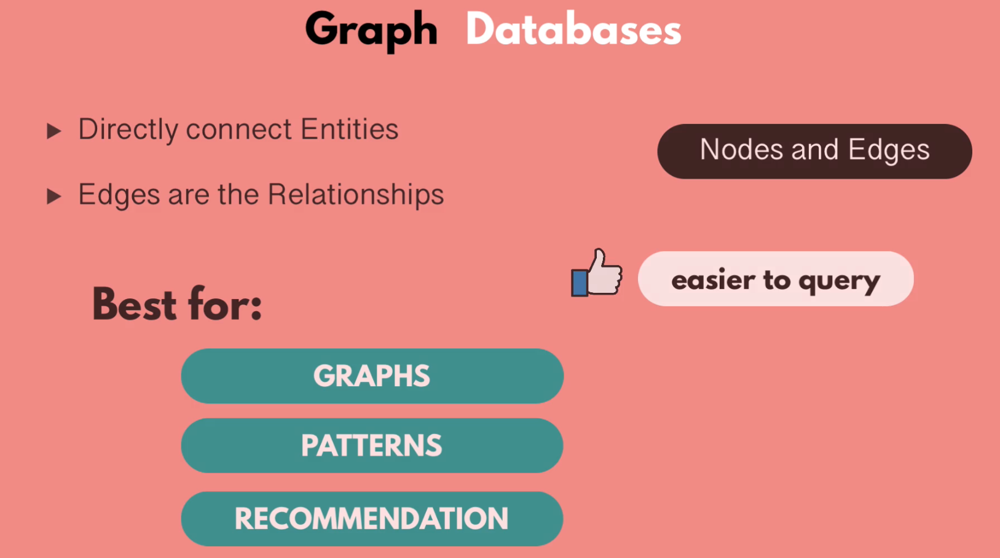

#### Advantages of NoSQL Database

It enables good productivity in the application development as it is not required to store data in a structured way.
It is a better option for managing and handeling large data sets.
It provides high scalability.
Users can quickly access data from the database through key-value.

# Cloud Database

A type of databases where data is stored in a virtual environment abd executes iver tge cloud computing platform.
It provides users with various cloud computing services (SaaS, PaaS, IaaS, etc.) for accessing the database. 
There are numerous cloud platforms, but the best options are:

**Amazon Web Services(AWS)**

**Microsoft Azure**

**Kamatera**

**PhonixNAP**

**ScienceSoft**

**Google Cloud SQL, etc.**

# Object-oriented Databases

The type of database that uses the object-based data model approach for storing data in the database system. 
The data is represented and stored as objects which are similar to the objects used in the object-oriented programming language, i.e. Realm, MongoDB

# Hierarchical Database

It is the type of database that stores data in the form of parent-children relationship nodes. 
Here, it organizes data in a tree-like structure. 
Data get stored in the form of records that are connected via links. 
Each child record in the tree will contain only one parent. 
On the other hand, each parent record can have multiple child records.

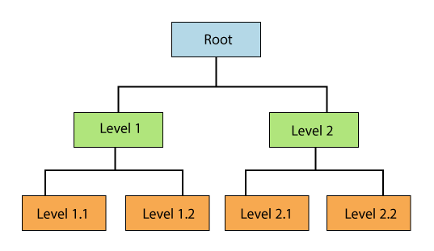

# Network Databases

It is the database that typically follows the network data model. 
Here, the representation of data is in the form of nodes connected via links between them. 
Unlike the hierarchical database, it allows each record to have multiple children and parent nodes to form a generalized graph structure.

# Personal Database

Collecting and storing data on the user's system defines a Personal Database. 
This database is basically designed for a single user.

### Advantages of Personal Database

It is simple and easy to handle. 
It occupies less storage space as it is small in size

# Operational Database

The type of database which creates and updates the databases in real-time,
It is basically designed for executing and handling the daily data operations in several business.
For example An organization uses operational databases for managing per day transactions.

# Enterprise Database

Large organizations or enterprises use this database for managing a massive amount of data. 
It helps organizations to increase and improve their efficiency. 
Such a database allows simultaneous access to users.

#### Advantages of Enterprise Database

Multi processes are supportable over the Enterprise database.
It allows executing parallel queries on the system.

# Search Database

Search Databases stores data into complex data format which gives realtime actionable insights.

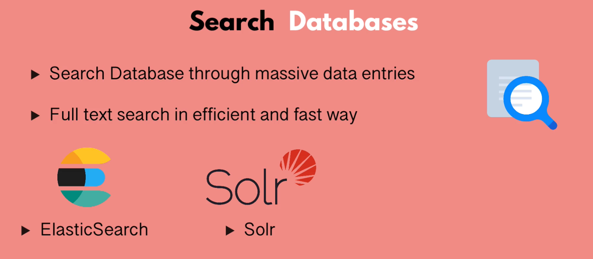
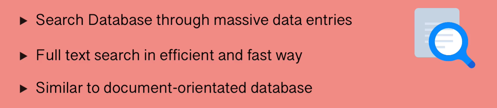
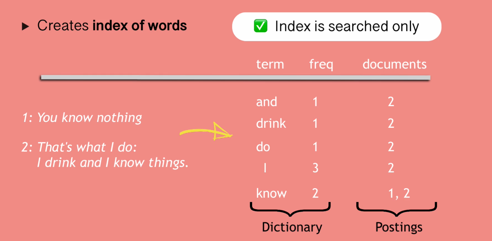
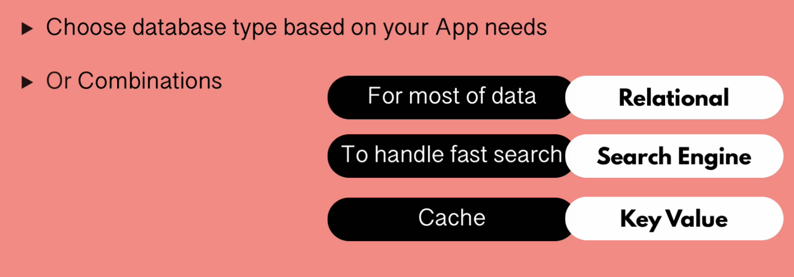