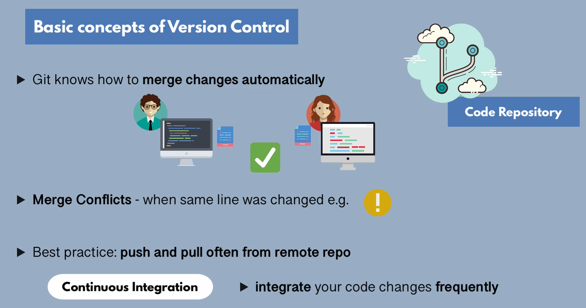
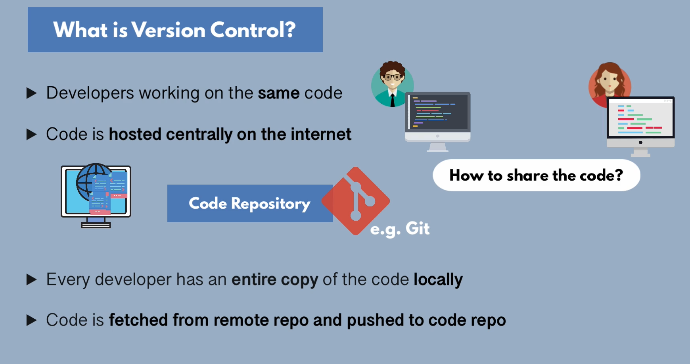
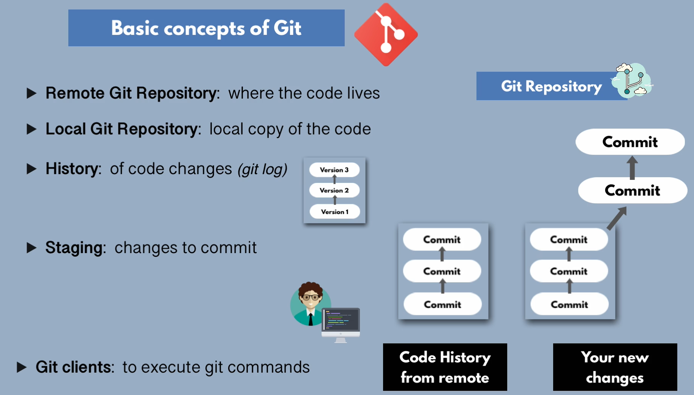
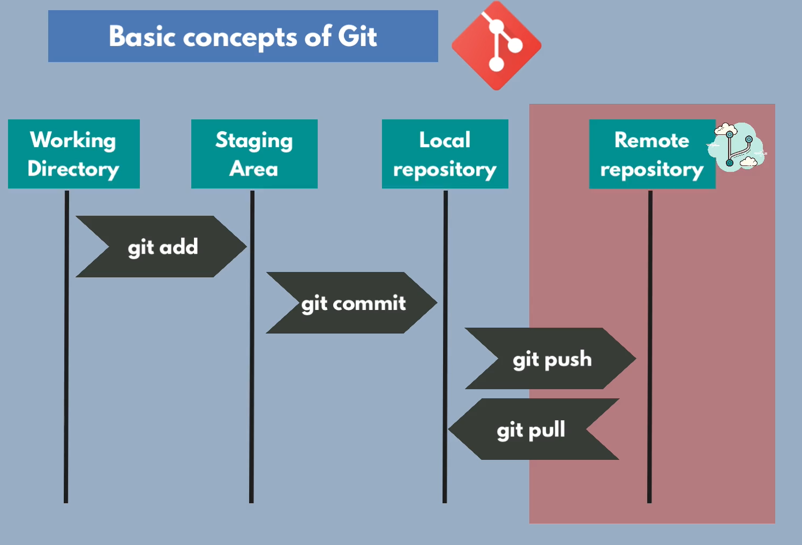
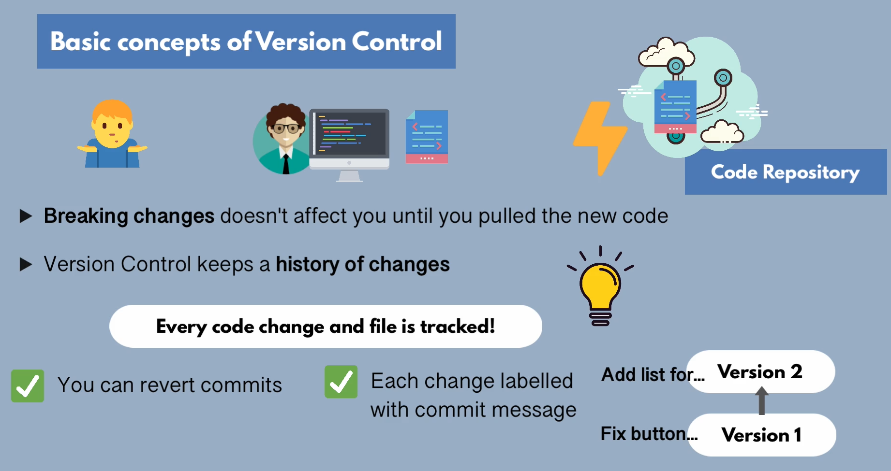
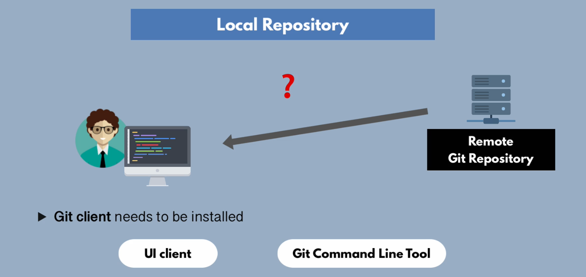
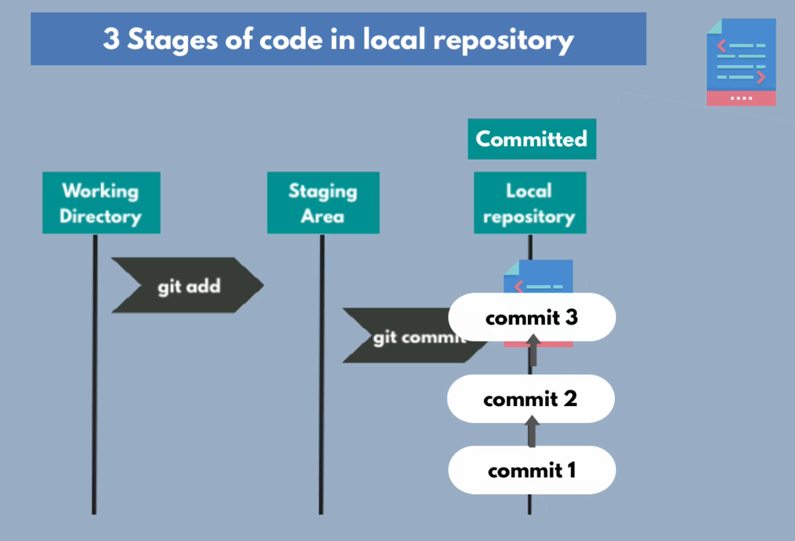

## Handful git commands

#### Git global setup

 
###### Information about repository : **ls folderpath/.git**
 
###### git config --global user.name anik587
 
###### git config --global user.email anik587@gmail.com
 
###### git config user.name anik587
 
###### git config --get user.name
 
###### git config --get user.email
 
###### git clone <git@repo.com>
 
###### git status

###### git add <name>
 
###### git add .
 
###### git add -u
 
###### git commit -m 'add name'
 
###### git pull -u origin branch-name
 
###### git push -u origin branch-name
 
###### git checkout branch-name
 
###### git checkout -b branch-name
 
###### git stash
 
###### git stash pop

