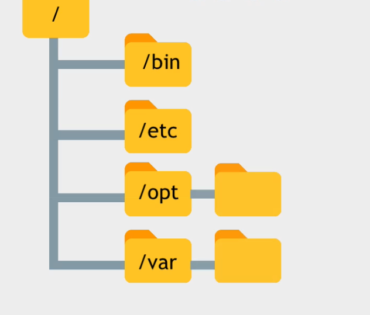

# Linux File System

Only one root folder hierarchically in tree structure, in comparison windows have multiple root folder. Interaction with root folder is not good practices let the programs and applications do that.
In Linux hidden files are called dotfiles because they start dot(.). 

# #Directories

### #Home directory:
Every user in linux will have its own space inside home directory except root user. Root user has its isolate space. Programs installed in a system are available for all user depending on permissions. Every user's data and configuration will be isolated.

### #bin & #sbin
Contains most basic and essential command of the system. They are available to all user. Contains binary. Binary is a binary-readable format. All superuser command are located here, they are system binary.

### #lib & @slib
All the libraries for executable binaries are located here. This is how programs can be split. All the libraries for superuser will be loaded here.

### #usr
Usr folder contains same folder structure as root. It has historical reason, initially folders were split due to storage shortage in unix, but that legacy continues. When executing a command will be executed for usr/bin or usr/sbin. Programs are stored in usr/local directory will be available for all user.   

### #opt
Programs mostly ide that split code that will store files here, otherwise in usr/local folder. Program will also be available for all user.

### #boot
Excursively for system. Responsible for booting.

### #etc
Writeable folder, all previous folder were only readable places where configuration for system-wise application is stored here.

### #dev
Extends for devices, all the connected devices program are stored here. Apps and drivers will access this not user.

### #var
Log and cache will be stored there.

### #temp
Temporary data files will be stored here for applications and programs.

### #media
External media will be mounted into here for example CD drive or USB. They will also be available in dev folder.

### #mnt
Temporary mount points. Historically, system admins mounted temporary files here.