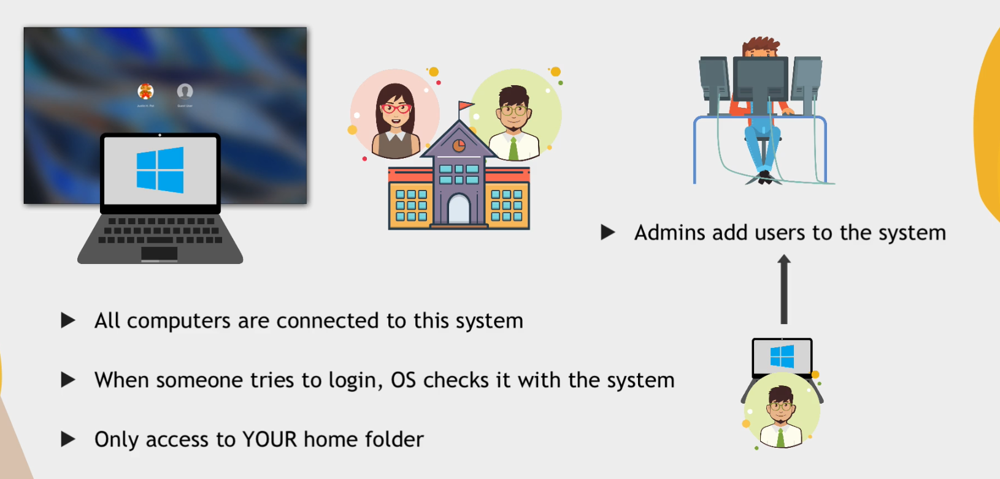
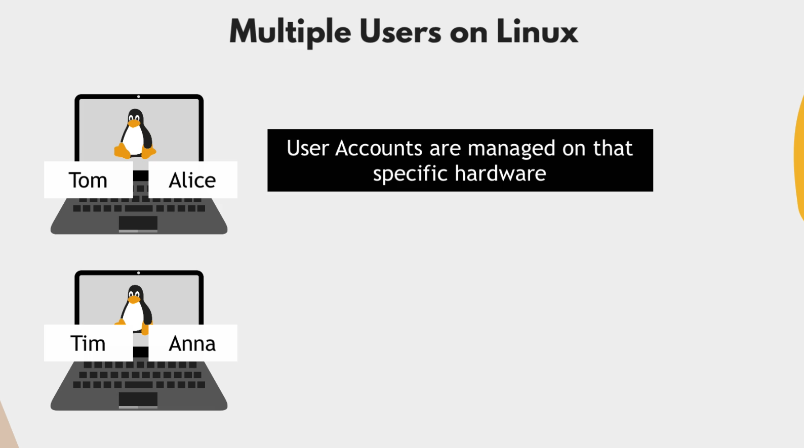
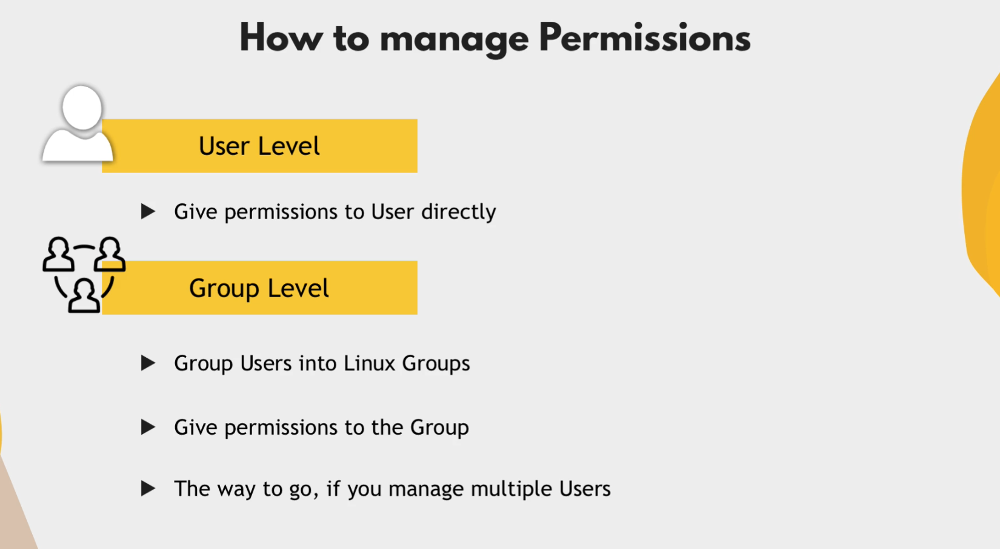

# USER AND PERMISSIONS

##### There are 3 categories of user in linux system

##### Root User/Super User: unrestricted permission, administrative work
##### Regular / Standard User: Regular User to login, default /home/name directory
##### Service User: Relevant for linux server distros, each service will get own user, best practice for security, don't run service with root user

##### Always 1 Root User per computer and can have multiple users and service users

##### In windows has a possibility of centrally managing users, you will not be able to change anything outside home directory

##### Difference between Linux and Windows User Management

##### That's why windows are much more preferred for workspace

##### In linux users are managed on that specific hardware

#### There are 2 different ways to manage permissions in Linux system
##### Give direct permission to user
##### Create a group and give permission to that group

#### Creating group and giving permission is more convenient because you just have to remove and to that group for permission

##### asdsadsad

##### Access control files
##### /etc/passwd: stores all users account information 
##### Information stored in following format USERNAME: PASSWORD: UID: GID: GECOS: HOMEDIR: SHELL
##### /etc/shadow
##### /etc/group: stores all groups