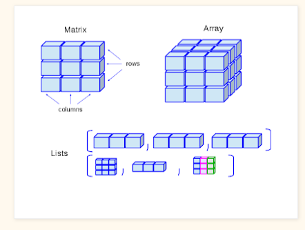
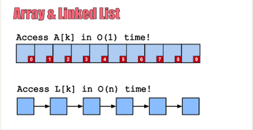
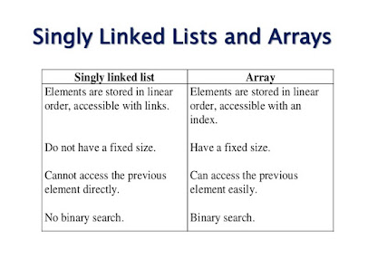

### Differences between an array and linked list

#### Flexibility
A linked list is more flexible than an array data structure because you can change the size of the linked list once created which is not possible with an array.

A linked list can also grow unlimited but the array cannot grow beyond its size. This is one of the most fundamental differences between an array and a linked list is that the length of the array cannot be changed once created but you can add unlimited elements into a linked list unless memory is not a constraint.

#### Memory utilization

One more significant difference between the linked list and array data structure comes from a memory perspective. the array requires a contiguous chunk of memory, which means if you want to create a large array and even if memory is available you may fail because there is no single chunk of memory that is big enough for your array.

This is a huge restriction and that's why any large array should be created at the very start of an application when you have a big chunk of memory available.

A linked list is more flexible in terms of memory as well. Since the linked list doesn't need a contiguous chunk of memory and nodes of a linked list can be scattered all around heap memory, it's possible to store more elements in the linked list than an array if you have fragmented heap space.

#### Memory required

linked list data structure requires slightly more memory than an array because apart from data i.e. the element you store, the linked list node also stores the address of the next node.

In Java, the linked list also has object metadata overhead because each node of the linked list is an object. In short, an array requires less memory than a linked list for storing the same number of elements.

#### Performance

Another key difference between an array and linked list data structure comes from a performance perspective, which is also the main factor to decide when to use the array over the linked list in Java.

An array gives O(1) performance for the searching element when you know the index but the linked list search is in order of O(n). So if you need fast retrieval and you know the index then you should use an array.

When it comes to the performance of adding and deleting elements then a linked list stores better than an array because adding into head or tail is O(1) operation if you have the necessary pointer but adding at a random position is O(n).

With an array, adding or removing is difficult because it requires rearranging all other elements as well.

#### Dimension and types

One of the structural differences between the linked list and array comes from their variety. The array can be multidimensional in Java which makes it an ideal data structure for representing matrices, 2D plain, 2D game board, terrain, etc.

On the other hand, a linked list has just one dimension, but it also comes in two flavors, a singly linked list, and a doubly linked list.

The Singly linked list holds the address of the next node only and thus allows you to move only in one direction i.e. forward but the doubly linked list contains two points, one for storing the address of the next node and the other for storing the address of the previous node. Which means it allows you to traverse in both forward and backward directions.

