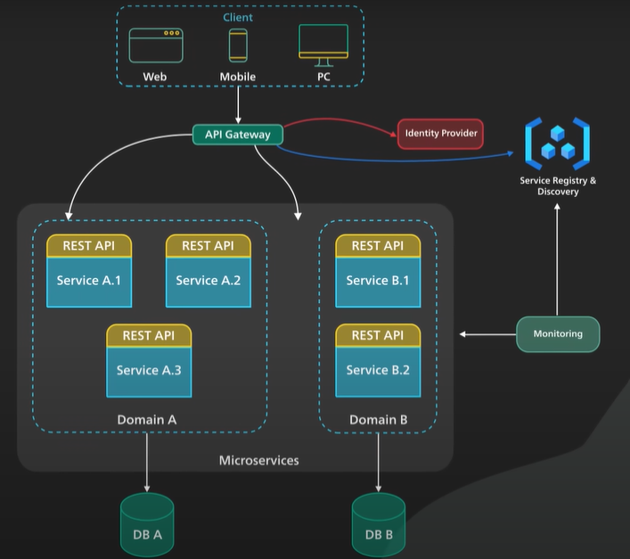

# Microservices
Microservices architecture enables large teams to build scalable applications that are composed to many losely cupled services. Allows to deploy often because easier to manage and blast redius is minimal. Microservices provides more flexibility to scale up or down services so operation flexibility is invaluable.
Typical microservices looks like

Microservices are losely cupled and thery are dedicated to some functionality inside a large scaled functionality. This type of services are sometimes called Domain.

Microservices interacts each other in defined interface in a surface area. Small service area makes the blast area and defacts limited. They makes each services to reason about in the context of the entire application.

Microservices talk to one another over a combination of remote procedure calls (RPC), event streaming and message brokers.

gRPC provides faster response but blast redius is huge.
Event streaming provides better isolation betheen services but they take longer to process.

Well-architectured microservices practice stong information hiding so they broke up monolithic database into its logical components and keeping a logioa componen well hidden inside its corresponding microservices, but database can nolonger maintain foreign keys so reponsibility of data integirity moved into application layer.

Api Gateway will handle authentication and authorization services through Identity Provider Service. To locate service route it consults a service registry and discover service. There are other facilities like Monitoring, deployment and troubleshooting etc. 

Microservices are not suitable for small companies, they hould build well-defined interface so that one day when application gets large then it be needing to split up.