# WEB SERVER NGINX

Ngnix is a powerful software suits which has progressed well beyond web 
server package. Some additional features, such as the reverse proxy and 
load balancing options, are well known.

Originally designed to tackle the c10k problem of handling 10,000 
concurrent connections, Nginx differentiated itself from Apache with 
an event-driven architecture. While Apache 2.4 added event-driven 
processing also, there are a number of distinct differences where 
Nginx still remains more flexible.

# A quick installation guide

Since the mainline release(currently 1.11.19) has all the latest 
features, you'll need to install ii directly from the Nginx repositories. Thankfully, Nginx is kind enough to provide Red Hat Enterprise Linux (RHEL), CentOS, SUSE Linux Enterprise Server (SLES), Debian and Ubuntu repositories, as well as OS X and Windows binaries.

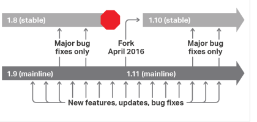

## Packages - RHEL/CentOS

To install the latest Nginx release, add the Nginx mainline repository 
by adding the following to 

_/etc/yum.repos.d/nginx.repo._

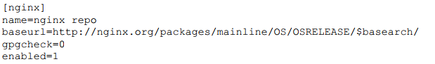

You'll also need to replace os with either rhel or centos, and replace 
osrelease with 5,6,or 7 for your correct release. YOu can check your 
version by running cat /etc/redhat-release. Once you have the repository 
installed, refresh the packages and then install Nginx.

_yum update_

_yum install nginx_

## Packages -Debian/Ubuntu

First, download the Nginx signing key for the packages and install it:

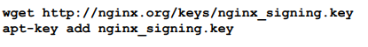

Or Use following command it there is any gpg warning

_sudo wget http://nginx.org/keys/nginx_signing.key | sudo gpg --dearmor | sudo tee /etc/apt/trusted.gpg.d/spotify.gpg_

Then, using your preferred Linux editor, we can add the sources to 

_/etc/apt/sources.list.d/nginx.list_

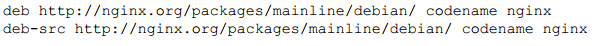

Replace codename with the release name with your os release name

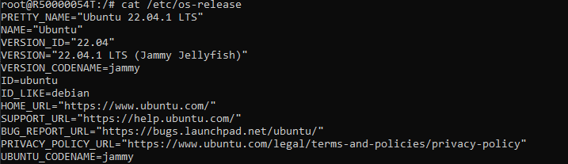

After adding the new source, we can then update the apt database and 
install Nginx.

_apt-get update_

_apt-get install nginx_

## Compiling form scratch
TO BE WRITTEN

## CentOS/RHEL

Like the debian build process, first we'll need to install the package 
build tools and the additional Extra Packages For Enterprise Linux (EPEL) repository:

_sudo yum install yum-utils epel-release mock_

Next, update /etc/yum.repos.d/nginx.repo and add the additional source 
repository

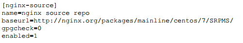

With the updated repository, we then create a directory for the build, 
and download the Source RPM (SRPM)

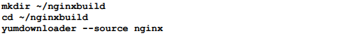

Next, download the required packages to complete the build

_yum-builddep nginx_

Once all the development packages have been downloaded, we can now 
extract the files from the SRPM. This name may vary based on the 
version on Nginx.

_rpm2cpio nginx-1.9.10-1.el7.ngx.src.rpm | cpio -idmv_

You should see an output of the source files similar to this

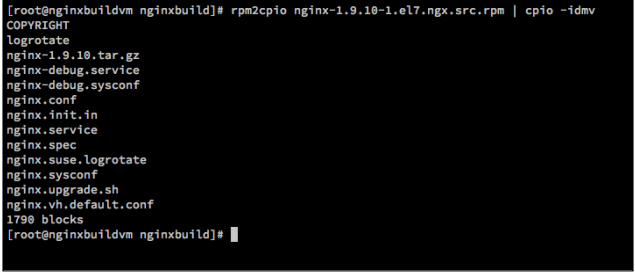

If we want to update the configuration and apply a patch or change one of the
defaults, then this can simply be done by editing the files.
We can now rebuild these files from source using mock, which is a tool for building
packages. The advantage of mock is that all the development dependencies are
contained within a chrooted environment, so it doesn't clutter your main
installation. This chrooted environment can be cleaned and removed without any
impact on the host system, which is great if you want repeatable builds.

To build, we run the following command:

_mock --buildsrpm --spec ~/nginxbuild/nginx.spec --sources ~/nginxbuild_

This generates the SRPMs, and they will be located in the /var/lib/mock/epel-7-
x86_64/result directory, along with the associated log files. Now that we have a
rebuilt SRPM, we can now compile it. Again, we're going to use mock so that
everything is neatly contained:

_mock --no-clean --rebuild var/lib/mock/epel-7-x86_64/result/nginx-1.9.11-1.el7.ngx.src.rpm_

Depending on your processing power, this may take five minutes or more to
complete. Once the build is complete, you should see the resultant binary RPM as
well as a debug RPM in the /var/lib/mock/epel-7-x86_64 directory. Here's an example:

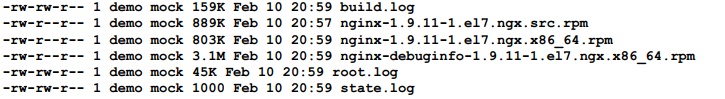

Now that we have the new binary file, we can install it via yum:

_sudo yum install /var/lib/mock/epel-7-x86_64/result/nginx-1.9.11-1. ngx.x86_64.rpm_

Regardless of your installation method, once you have NGINX up and
running, you should be able to browse to it via the IP address and/or Fully
Qualified Domain Name (FQDN) and see something very similar to what
is shown here:

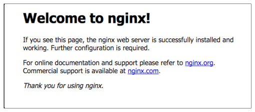

Here's a quick reference table of available commands

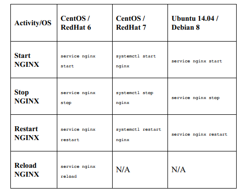

we can check the nginx configuration files by using

_nginx -t_

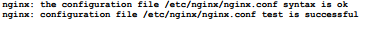

# Configuring Nginx

By default, Nginx will have two main configuration files. The first is 
/etc/nginx/nginx.conf which contains the main server configuration. The 
second is /etc/nginx/default.conf. Default configuration looks something like

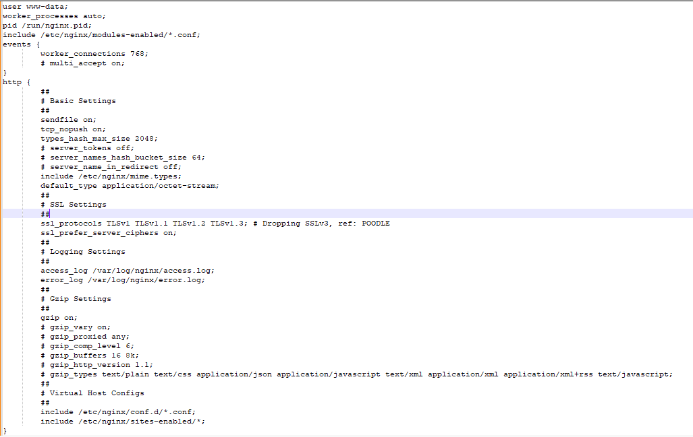
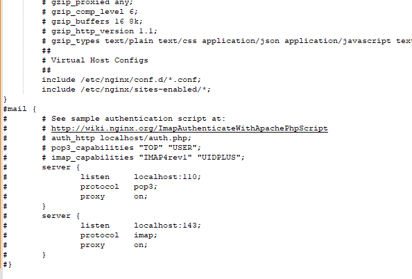

The configuration files have two main components in them—simple
directives and block directives. Simple directives are one-line items which
are simple name and value, followed by a semicolon (;). A block directive
has a set of brackets and allows configuration items to be set within a
specific context. This makes the configuration files easier to follow,
especially as they get more complex.

Here are a few of the key configuration items. Firstly, user nginx defines the
user in which NGINX will run as. This is important to note if you have a
server-side script which requires the ability to write files and a user will
also require permission to read the files.

Secondly, worker_processes sets the number of worker processes that NGINX
will start. While a default of 1 doesn't sound very high, the event-driven
nature means that this certainly won't be a limitation initially. The optimal
number of processes depends on many factors, but an easy starting
reference is to go by the number of CPU cores your server has.

Next, worker_connections is the maximum amount of simultaneous connections
that a worker process can open. In the default configuration, this is set to
1024 concurrent connections.

Lastly, the include /etc/nginx/conf.d/*.conf; line tells NGINX to load all the
.conf files as if they were all part of the main nginx.conf file. This allows you
to separate the configuration for different sites.

# Enabling modules

By default, not every module for NGINX has been compiled and is
available. As of version 1.9.11 (released in February 2016), NGINX added
dynamic modules, similar to the Dynamic Shared Objects (DSO) like the
Apache HTTP server.

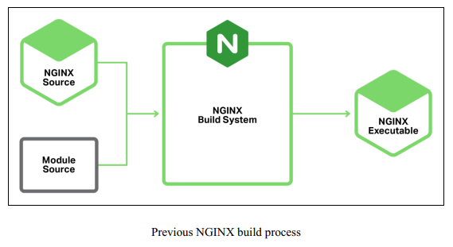

Previous to this, you needed to recompile NGINX every time you updated a
module, so this is a big step forward. Being statically compiled into the
main binary also meant that each instance of NGINX loaded all the
modules internally, regardless of whether you needed them or not. This is
why the mail modules were never compiled in with the standard binaries.

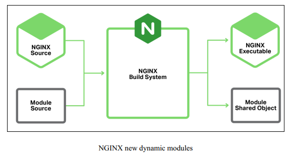

However, even though 1.9.11 added the dynamic modules, none of the
standard modules are dynamic by default. To make them into dynamic
modules, you'll need to update the configure options. For example, to make
the mail module dynamic, update --with-mail to --with-mail=dynamic.

The main nginx.conf configuration file will then need the following:

_load_module "modules/ngx_mail_module.so";_

Official Link https://www.nginx.com/resources/wiki/extending/

Official Link https://www.nginx.com/resources/wiki/modules/

# Deploying a basic site

If you have a static website, this is very easy to deploy with NGINX. To serve static 
files, we're going to edit the default site configuration 
file /etc/nginx/conf.d/default.conf and make a few small changes.

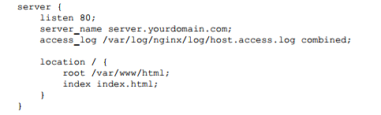

If the folder doesn't exist, create the /var/www/vhosts directory with the
following command:

_mkdir -p /var/www/vhosts_

Copy your existing website files into the /var/www/vhosts directory.Ensure the files and folders have permission to be read by the nginx
user:

_chmod -R o+r /var/www/vhosts_

_chown -R nginx:nginx /var/www/vhosts_

From your web browser, browse the site and check that it's working.

# Basic monitoring

Monitoring both the performance and uptime of a web server is paramount
when you want to ensure consistent performance. There are a number of
ways both these aspects can be monitored, all with varying levels of
complexity and information. We'll focus on some simpler examples
to give you a starting point to go forward with.

We can enable the basic NGINX stub_status page to give some rudimentary
statistics and service status. To enable, edit your site config and add the
following

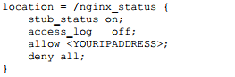

To prevent information leakage about your system, we have added the allow
command. This should be your IP address. This is followed by the deny all
command to prevent anyone else from loading the URL. We've also turned
off access logs for this URL to save space

After reloading your configuration (hint: systemctl reload nginx for systemdbased OS), you can now load the new URL /nginx_status in your browser.
You should see something like the following:

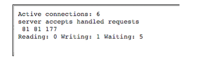

# Real-time statistics

When your web server is important to you, you'll want to see what's going
on in real-time. One great utility to do this is ngxtop. This program monitors
your real-time access log in to display useful metrics such as the number of
requests per second, HTTP statuses served, and pages/URLs served. This
information can be a great aid to determine what your top pages are and if
there is an increased rate of errors.

### How to do it

To install ngxtop, you'll first need to install the Python package manager, pip.
On a Debian/Ubuntu-based system, you'll need to run the following:

_apt-get install python-pip_

For a Red Hat- / CentOS-based system, the EPEL repository is required
first. To install, run the following:

_yum install epel-release_

_yum install python-pip_

Once you have pip installed, you can now install ngxtop:

_pip install ngxtop_

This will download the required files and install ngxtop for you. It's now
ready to use.

### How it works

The ngxtop utility can be simply called from the command line, and it will
attempt to read the log file location from the configuration. However, if
you're running virtual hosts, it may not read the access log location correctly.
The easiest way in this scenario is to manually specify the log location.
Consider the following example:

_ngxtop -l /var/log/nginx/access.log_

This will display a console-based view of what URLs are being accessed.
Here's a basic example:

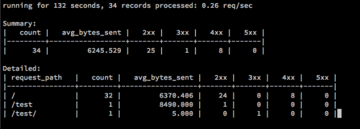

We can filter only the 404 pages with the following:

_ngxtop -l /var/log/nginx/access.log --filter 'status == 404'_

Official Link https://github.com/lebinh/ngxtop